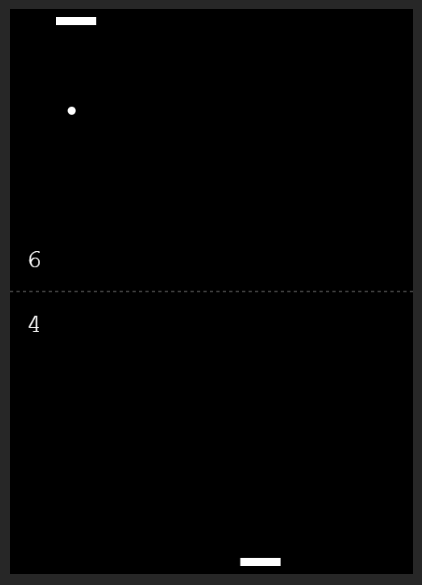
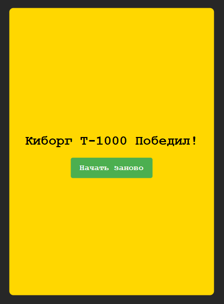

# pong-game (аркадная видеоигра pong)
Описание: 
Классическая теннисная спортивная игра pong. В начале игры компьютер не сдвинет свою ракетку, пока не начнет свое движение пользователь. Управление ракеткой пользователя осуществляется движением мышкой внутри игрового поля влево и вправо. Двигаясь, мы начинаем игру с компьютерным игроком. Счет игры обновляется с левой стороны игрового поля. Мяч возрождается с центра поля. Игра продолжается до тех пор, пока кто-то не наберет 7 очков. При окончании игры выводится экран с информацией о победителе и кнопкой "Начать заново". 
Игра реализована с помощью анимирования html элемента canvas (CanvasRenderingContext2D Canvas API). Рендер выполнен на основе метода Window.requestAnimationFrame() взамен ранее популярному setInterval, но не обеспечивающему в полном объеме согласованность 60 кадров в секунду. 
Игра полностью мобильно адаптируема (mobile responsible). 
**Pong game:**

**Game Over screen:**

